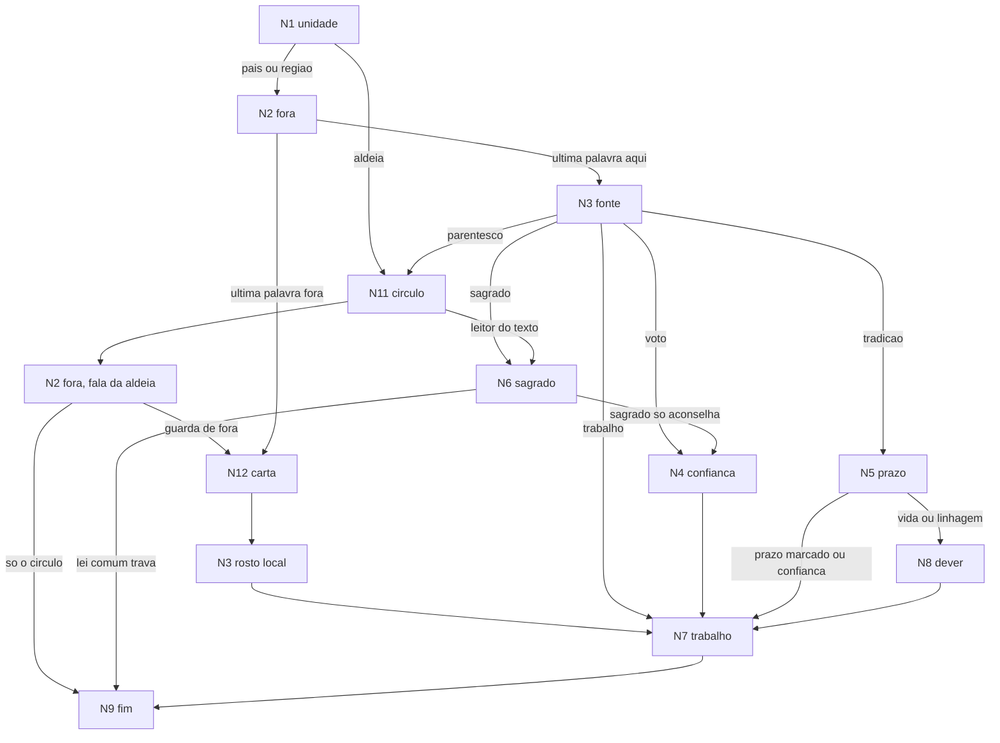

# Governo ideal — fluxograma por parâmetros

Mapa do teste jogável em `/governo`. O código está em [`lib/governoFlow.ts`](../lib/governoFlow.ts). Não muda os dez eixos. A pessoa não vê nome de regime: os ids desta página ficam no placar, e a tela usa o título descritivo.

Este documento propõe o modelo de conteúdo seguinte: um fluxograma de Valmora em que cada resposta empurra **parâmetros mudos**. No fim, a distância até centróides internos escolhe um arranjo principal e, se couber, um segundo. A pessoa não vê nome de regime, partido ou ideologia — nem no meio do teste, nem como opção, nem como título do resultado.

Rótulos como `monarquista` ou `colonia` existem só nesta página, na coluna “interno”. A UI usa o título descritivo.

## Princípios

1. **Sem nome taxativo no meio do teste.** A opção descreve um mecanismo (quem senta, até quando, quem pode desfazer). Não oferece “monarquia”, “presidencialismo”, “teocracia”, “república soviética”, “estado corporação”, “colônia” nem equivalentes.
2. **Problema e preço em toda opção.** O mesmo espírito do `hint` / `solves` / `tradeoff` de hoje. Nenhuma opção é a resposta moralmente certa.
3. **Trilha separada dos dez eixos.** Este fluxo não lê nem escreve economia, autoridade, liberdade, igualdade, tradição, ambiente, segurança, global, tecnologia ou corpo. Não muda arquétipo. Meu resultado só mostra este bloco se a pessoa terminou esta trilha.
4. **Parâmetro mudo, título falado.** A conta usa ids internos. A frase que a pessoa lê descreve o arranjo (“uma linhagem no mando, com dever de pão e terra”), não o verbete.
5. **Fluxograma de verdade.** Nem toda pergunta aparece. Uma resposta abre, pula ou troca o texto da seguinte. Caminho típico: 6 a 8 nós, de um baralho de 11.
6. **Valmora, não o mapa real.** Aldeia, câmara, linhagem, ofício, mina, fronteira, carta vinda de fora. Sem país, partido ou líder do mundo real.
7. **Empate fica visível.** Se dois centróides ficam perto, o resultado mostra os dois títulos e não finge um vencedor único. O mesmo espírito do “em aberto” atual, agora entre arranjos e não entre opções de uma categoria.

### Lista negra (texto que a pessoa vê)

Não usar, nem em título de resultado: monarquia, rei, rainha, presidencialismo, presidente, parlamentarismo, parlamento, teocracia, teocrata, soviete, soviético, corporativismo, corporação, fascismo, colônia, protetorado, república, democracia, socialismo, comunismo, partido, liberal, ditadura, anarquia.

Pode usar: chefe, câmara, linhagem, costume, ofício, conselho, delegado, aldeia, ancião, lei sagrada, prazo, confiança, carta, ramo, base.

“Protetor” como nome de regime fica de fora. No dilema, dizer “um poder de fora que oferece frota”.

## Parâmetros

Dois tipos. **Bipolar** soma inteiros negativos e positivos. **Canal** só soma para cima (0, 1, 2). Pergunta pulada não é zero informativo no bipolar: entra como “sem evidência” e o centróide daquele eixo não pesa na distância (ver mapeamento). Canal pulado fica 0 — “não foi escolhido”.

| Id | Tipo | − / baixo | + / alto |
| --- | --- | --- | --- |
| `escala` | bipolar | o círculo miúdo (aldeia, clã) | o país como uma regra só |
| `fora` | bipolar | a última palavra mora fora | a última palavra fica aqui |
| `quem` | bipolar | um corpo coletivo | uma pessoa |
| `prazo` | bipolar | cai fácil, prazo curto | dura, difícil de desfazer |
| `queda` | bipolar | a câmara derruba o mando | o mando fica mesmo contra a câmara |
| `voto` | canal | — | um voto contado do país |
| `tradicao` | canal | — | linhagem, costume antigo, nome que já vinha |
| `sagrado` | canal | — | texto sagrado e quem o lê |
| `oficio` | canal | — | cadeira estável do ramo econômico, os dois lados |
| `conselho` | canal | — | delegado de quem trabalha, que a base puxa de volta |
| `parentesco` | canal | — | sangue, ancião, quem se conhece pelo nome |
| `tutela` | canal | — | guerra, moeda ou tratado nas mãos de fora |
| `ordem` | canal | — | continuidade, um mando, o amanhã parecido com o ontem |
| `cuidado` | canal | — | pão, terra, teto de quem está por baixo |
| `plano` | canal | — | quem produz dirige o plano comum |

`fora` e `tutela` não são o mesmo eixo com sinal trocado. Dá para querer a última palavra aqui (`fora` +) e mesmo assim não ser um país (`escala` −): é o círculo miúdo. Dá para aceitar tutela e ainda ter um rosto local (`quem` +).

## Perfis internos

Não aparecem na UI. Servem de centróide e de nota de autor. O número é o valor **esperado** nesse parâmetro. Célula vazia = 0 e, se o parâmetro bipolar não foi perguntado no caminho, esse eixo sai da distância para este perfil.

| Interno | `escala` | `fora` | `quem` | `prazo` | `queda` | Canais altos | Canais de fim |
| --- | --- | --- | --- | --- | --- | --- | --- |
| `monarquista` | +2 | +2 | +2 | +2 | +1 | `tradicao` 2 | `ordem` 2 |
| `monarquia_social` | +2 | +2 | +2 | +2 | +1 | `tradicao` 2 | `cuidado` 2, `ordem` 1 |
| `presidencialista` | +2 | +2 | +2 | +1 | +2 | `voto` 2 | `ordem` 1 |
| `parlamentarista` | +2 | +2 | −1 | −2 | −2 | `voto` 2 | — |
| `teocrata` | +1 | +2 | 0 | +1 | +1 | `sagrado` 2 | `ordem` 2 |
| `sovietica` | +1 | +2 | −2 | −2 | −1 | `conselho` 2 | `plano` 2 |
| `corporacao` | +2 | +2 | −1 | +1 | +1 | `oficio` 2 | `ordem` 2, `plano` 1 |
| `colonia` | +1 | −2 | +1 | +1 | +1 | `tutela` 2 | `ordem` 1 |
| `tribal` | −2 | +1 | −1 | +1 | 0 | `parentesco` 2 | `ordem` 1, `cuidado` 1 |

Diferenças que o mapa precisa guardar:

- `monarquista` e `monarquia_social` compartilham linhagem longa. Separam-se em `ordem` contra `cuidado`.
- `presidencialista` e `parlamentarista` compartilham `voto`. Separam-se em `queda` e `prazo`: um fica até a data; o outro cai com a câmara.
- `sovietica` e `corporacao` falam de trabalho. Uma puxa o delegado de volta e não dá cadeira a quem só é dono. A outra senta os dois lados do ramo e a cadeira dura.
- `colonia` é tutela, não “Estado fraco”. Há país (`escala` +) e última palavra fora.
- `tribal` não é “região com imposto próprio”. É o círculo que se conhece. Região sem clã não basta para este centróide.

### Títulos que a pessoa pode ver

| Interno | Título | Linha de apoio |
| --- | --- | --- |
| `monarquista` | Uma linhagem no mando, por costume, difícil de desfazer | A casa antiga segue. A regra não muda com o ano. Uma geração pode ficar presa ao desenho. |
| `monarquia_social` | Uma linhagem no mando, com dever de pão e terra | A casa fica, e o título se explica pelo cuidado. O cuidado pode virar favor de quem está perto. |
| `presidencialista` | Um chefe com prazo marcado, que a câmara não derruba no meio | Uma pessoa governa até a data, mesmo se a casa resmungar. O erro dura até lá. |
| `parlamentarista` | Um governo que cai quando a câmara retira a confiança | Quem governa sai da casa e sai quando a casa deixa de confiar. Obra longa não atravessa a briga. |
| `teocrata` | A lei sagrada acima da lei comum | A regra civil para onde o texto não deixa passar. Quem lê o texto vira o cargo. |
| `sovietica` | Conselhos de quem trabalha, com volta fácil do delegado | O mando sobe da atividade, não desce da capital. O plano miúdo trava, e quem não está na base não senta. |
| `corporacao` | Os ofícios no mando, os dois lados do ramo | Quem produz e quem emprega no mesmo ramo sentam juntos, sob quem coordena. O ramo pode virar feudo. |
| `colonia` | Guerra e tratado nas mãos de fora; o cotidiano fica aqui | A frota e a assinatura externa não dependem do nosso caixa. Quando a carta muda, não há como dizer não. |
| `tribal` | O círculo do sangue e do costume, sem máquina de país | A aldeia decide. O que houver de maior é aliança, não um mando único. A regra muda de vale para vale. |

O resultado mostra o título, a linha de apoio, e duas ou três escolhas que mais puxaram aquele centróide (cena + opção + uma frase). Não mostra o id interno, nem a tabela, nem “você é X”.

## Mapa do fluxo

N9 é o fim de todo caminho que chegou nele. Não há nó depois.

### O que se pula

| Se aconteceu | Pula | Por quê |
| --- | --- | --- |
| N1 = aldeia | N3 nacional, N4, N5, N7, N8 | Não há câmara de país nem cadeira de ofício a perguntar. O círculo já é o mando. |
| N2 = última palavra fora | N4, N5, N6, N8 na forma soberana | Quem cai ou dura aqui não é a pergunta principal. Entra N12 e o rosto local. |
| N4 foi perguntado | não há um N10 “quem muda a regra” | Confiança já disse quem desfaz o mando. |
| N3 = tradição e N5 = vida ou linhagem | N4 | A linhagem não é um gabinete da câmara. O dever (N8) faz o trabalho de separar os dois perfis longos. |
| N6 = lei comum não atravessa o sagrado | N4 e N7 | A câmara e o ofício não revogam o texto. |
| N3 = trabalho e N7 = conselho revogável | N5 | A volta do delegado já é o prazo. |
| N7 = bancas estáveis | N4 | A cadeira não cai com a confiança de uma câmara eleita. N5 curto ainda entra: a cadeira dura com o ramo. |
| N1 = região | nada obrigatório | Região não é clã. Segue o tronco do país, com `escala` um ponto mais baixa. |

Reordenar, não só pular:

- N1 = aldeia põe N11 **antes** de N2. A pessoa fala do círculo antes de falar de frota de fora.
- N3 = parentesco, mesmo depois de ter dito “país” em N1, desvia para N11 e encerra em N9. A contradição (país na unidade, sangue na fonte) fica no vetor e tende a secundário misturado, não a um desvio silencioso.
- N6 no caminho do círculo só aparece se N11 escolheu o leitor do texto. Aí o fim pode ser lei sagrada de aldeia (`teocrata` com `escala` baixa): os dois entram no topo se a guarda disparar.

Caminho mais curto: aldeia → círculo → só o círculo → fim (4 nós). Caminho de voto: unidade → fora → fonte → confiança → trabalho → fim (6 nós). Caminho de linhagem longa: unidade → fora → fonte → prazo → dever → trabalho → fim (7 nós).

## As perguntas

Cada opção lista parâmetros (inteiros) e um peso **mole** de perfil. O peso mole não escolhe sozinho. Entra como bônus pequeno na distância (abaixo). Texto de jogador em português. Ids em inglês, estáveis para um passe futuro.

### N1 `unidade` — Onde a decisão mora?

Sempre a primeira.

Valmora cabe numa viagem de semanas. Tem aldeia que só obedece a quem viu nascer, região com caixa próprio, e gente que quer uma regra só da mina até a fronteira. Onde a decisão mora de verdade?

**A. `aldeia` — No círculo de quem se conhece pelo nome.** O que houver de maior é aliança, não um mando único.

- Problema: a regra de longe não conhece o inverno daqui.
- Preço: o vale ao lado faz outra lei, e quem chegou de fora não tem voz.
- Parâmetros: `escala` −2, `parentesco` +2, `fora` +1
- Mole: `tribal` +2
- Segue: N11

**B. `regiao` — Na região.** Escola, guarda e parte do imposto ficam perto. O centro só segura a fronteira.

- Problema: clima e língua não são os da capital.
- Preço: a região rica pode recusar partilha.
- Parâmetros: `escala` −1
- Mole: nenhum perfil +2. Não é clã e não é mando único.
- Segue: N2 (fala do país)

**C. `pais` — No país inteiro.** A mesma regra chega na capital e na fronteira.

- Problema: a decisão não muda de vale para vale.
- Preço: o abuso no centro se espalha inteiro.
- Parâmetros: `escala` +2
- Mole: `tribal` −2
- Segue: N2 (fala do país)

### N2 `fora` — A última palavra pode morar fora?

Segunda, com fala diferente.

Fala do país (veio de B ou C em N1): um poder vizinho oferece frota, moeda estável e tratado. Em troca, guerra, alfândega e a assinatura externa passam para lá. Escola, rua e hospital podem ficar aqui.

Fala da aldeia (veio de N11): a aldeia não segura uma guerra longa. O mesmo poder oferece guarda. A praça continuaria de quem já senta nela.

**A. `carta_de_fora` — Aceito a troca.** Guerra e tratado saem daqui. O cotidiano fica.

- Problema: frota e crédito não dependem do nosso inverno.
- Preço: quando a carta muda, não há a quem dizer não.
- Parâmetros: `fora` −2, `tutela` +2, `escala` +1 só se a fala era do país
- Mole: `colonia` +2. Na fala da aldeia, também `tribal` +1 (híbrido).
- Segue: N12

**B. `ultima_aqui` — Não.** Guerra, moeda e tratado ficam aqui, mesmo mais fracos. Na fala da aldeia: aliança só com quem senta no círculo.

- Problema: ninguém de fora reescreve a regra.
- Preço: a frota e o crédito saem do nosso caixa.
- Parâmetros: `fora` +2, `tutela` −2. Na fala da aldeia, `escala` −1 e `parentesco` +1 no lugar do `tutela` −2 (não havia país a defender).
- Mole: `colonia` −2. Na aldeia, `tribal` +1.
- Segue: N3 se a fala era do país. N9 se a fala era da aldeia.

### N3 `fonte` — De onde vem o direito de mandar?

Só no tronco soberano (N2 = última palavra aqui, fala do país). No ramo da carta, a pergunta vira o rosto local (opções D–F abaixo) e vem **depois** de N12.

A câmara, a mina e o culto cabem na mesma capital. Quando os três batem o pé, quem tem o direito de mandar?

**A. `voto_contado` — Um voto contado, de todo o país.**

- Problema: quem perde sabe o tamanho da derrota.
- Preço: meio país obedece a uma maioria de um ano.
- Parâmetros: `voto` +2
- Mole: `presidencialista` +1, `parlamentarista` +1
- Segue: N4

**B. `linhagem` — Um nome que já vinha.** A casa, ou o costume que aponta o seguinte sem abrir urna.

- Problema: o mando não recomeça a cada estação.
- Preço: quem nasceu fora dessa linha não chega lá.
- Parâmetros: `tradicao` +2, `quem` +1
- Mole: `monarquista` +1, `monarquia_social` +1
- Segue: N5

**C. `leitor_do_texto` — Quem lê a lei sagrada** e diz o que ela exige agora.

- Problema: a regra não fica ao sabor do medo de um ano.
- Preço: quem não lê o texto não revoga quem lê.
- Parâmetros: `sagrado` +2
- Mole: `teocrata` +2
- Segue: N6

**D. `rosto_nomeado` — Um rosto daqui, posto e tirado por quem está de fora.** (Só no ramo da carta.)

- Problema: a rua tem a quem procurar.
- Preço: esse rosto não diz não à carta.
- Parâmetros: `quem` +2, `queda` +1, `tutela` +1
- Mole: `colonia` +2
- Segue: N7, depois N9

**E. `rosto_com_prazo` — Um rosto daqui, escolhido aqui, com data para sair.** A carta de fora segue valendo por cima. (Só no ramo da carta.)

- Problema: o cotidiano troca de chefe sem esperar o de fora.
- Preço: a data local não muda a guerra nem o tratado.
- Parâmetros: `quem` +1, `voto` +1, `prazo` +1, `tutela` +1
- Mole: `colonia` +1, `presidencialista` +1
- Segue: N7, depois N9

**F. `rosto_camara` — O rosto local cai se a câmara daqui retirar a confiança.** A carta segue por cima. (Só no ramo da carta.)

- Problema: a casa local corrige quem administra a rua.
- Preço: a carta não cai junto.
- Parâmetros: `quem` −1, `queda` −2, `voto` +1, `tutela` +1
- Mole: `colonia` +1, `parlamentarista` +1
- Segue: N7, depois N9

**G. `de_quem_trabalha` — De quem trabalha na atividade**, não de um voto geral nem de um nome antigo.

- Problema: quem não põe a mão na coisa não desenha a regra dela.
- Preço: quem está fora da atividade fica sem cadeira.
- Parâmetros: `plano` +1
- Mole: `sovietica` +1, `corporacao` +1
- Segue: N7

**H. `mesmo_sangue` — De quem é do mesmo sangue e da mesma aldeia**, mesmo que a unidade lá atrás tenha sido o país.

- Problema: o mando não é um estranho com carimbo.
- Preço: o país que se disse inteiro não cabe nessa regra.
- Parâmetros: `parentesco` +2, `escala` −1
- Mole: `tribal` +2
- Segue: N11, depois N9. Não pergunta N4.

### N4 `confianca` — O mando cai se a câmara retirar a confiança?

Depois de N3 = voto. Também depois de N6 se o sagrado só aconselha.

A câmara e o chefe deixaram de se falar. A obra no rio está no meio. O que acontece com quem governa?

**A. `cai` — Cai.** O governo só dura enquanto a câmara confia. Outro nome, saído dessa casa, segue a obra ou a enterra.

- Problema: o mando que perdeu a casa não fica até o estrago completar.
- Preço: a obra longa não atravessa a briga.
- Parâmetros: `quem` −1, `prazo` −2, `queda` −2
- Mole: `parlamentarista` +2, `presidencialista` −2
- Segue: N7

**B. `fica_ate_a_data` — Não cai.** Houve uma escolha com data. A pessoa fica até lá. A câmara pode travar a lei, não o cargo.

- Problema: o programa eleito não morre numa moção.
- Preço: o erro dura até a data.
- Parâmetros: `quem` +2, `prazo` +1, `queda` +2
- Mole: `presidencialista` +2, `parlamentarista` −2
- Segue: N7

**C. `a_casa_governa` — Não há chefe separado.** A própria câmara governa por um grupo que ela desfaz quando quiser.

- Problema: não existe um mando ao lado da casa, disputando com ela.
- Preço: ninguém responde sozinho quando a obra para.
- Parâmetros: `quem` −2, `prazo` −1, `queda` −2, `voto` +1
- Mole: `parlamentarista` +1, `sovietica` +1
- Segue: N7

### N5 `prazo` — Até quando dura quem manda?

Depois de N3 = linhagem. Versão curta também depois de N7 = bancas (a cadeira dura com o ramo, não com a pessoa): nesse caso só as opções A e D fazem sentido; B e C não são oferecidas.

O nome já está no cargo. A mina pede uma obra de vinte anos. Até quando esse mando dura?

**A. `enquanto_confiam` — Enquanto a confiança durar.** Um círculo estreito, não o país inteiro, pode trocar o nome.

- Problema: a linhagem segue, a pessoa não é eterna.
- Preço: o círculo estreito vira o verdadeiro cargo.
- Parâmetros: `prazo` −1, `quem` 0, `tradicao` +1
- Mole: `monarquista` +0 (não empurra os dois perfis longos)
- Segue: N7. Não passa em N8.

**B. `prazo_marcado` — Um prazo marcado, e depois sai.** O seguinte pode ser de outra casa.

- Problema: dá para contar o fim.
- Preço: vinte anos de mina não cabem num prazo curto. Quem espera herdar não constrói.
- Parâmetros: `prazo` +1, `quem` +1, `voto` +1
- Mole: `presidencialista` +1, `monarquista` −1
- Segue: N7. Não passa em N8.

**C. `vida_ou_linha` — A vida inteira, e depois quem a linha já aponta.**

- Problema: o desenho sobrevive a quem está vivo.
- Preço: uma geração inteira não escolhe de novo.
- Parâmetros: `prazo` +2, `quem` +2, `queda` +1, `tradicao` +1
- Mole: `monarquista` +1, `monarquia_social` +1
- Segue: N8

**D. `cadeira_do_ramo` — A cadeira não é de pessoa.** Dura enquanto o ramo existir. (Oferecida no caminho das bancas, e também aqui como recusa da linhagem.)

- Problema: o ofício não depende do herdeiro.
- Preço: o ramo que sentou não sai quando o país muda de ideia.
- Parâmetros: `oficio` +2, `prazo` +1, `quem` −1
- Mole: `corporacao` +2, `monarquista` −1
- Segue: N7 se ainda não foi perguntado; senão N9.

### N6 `sagrado` — A lei comum pode atravessar o sagrado?

Depois de N3 = leitor do texto. Também se N11 escolheu o leitor: aí a “lei comum” é o costume da aldeia, e o texto pode ser de fora do vale.

A lei sagrada proíbe o que a maioria, ou o ancião, agora quer permitir. Quem cede?

**A. `texto_trava` — A lei comum cede.** Quem guarda o texto trava a mudança.

- Problema: um susto não risca o que foi posto acima da maioria.
- Preço: o intérprete vira o cargo, e o texto não envelhece em público.
- Parâmetros: `sagrado` +2, `queda` +1, `ordem` +1
- Mole: `teocrata` +2
- Segue: N9. Pula N4 e N7.

**B. `texto_aconselha` — O texto aconselha.** Se a câmara, ou o círculo, insistir, a lei comum passa.

- Problema: o culto não congela o país.
- Preço: o que era chão vira opinião.
- Parâmetros: `sagrado` −1 (desconta um dos +2 da fonte; o chão não era tão alto)
- Mole: `teocrata` −2
- Segue: N4 se veio do país. N9 se veio da aldeia.

**C. `culto_miudo` — Cada círculo guarda o seu culto.** Não há um texto só para Valmora.

- Problema: o vale não reza a regra do vizinho.
- Preço: não existe um chão comum quando os círculos se encontram.
- Parâmetros: `sagrado` −1, `escala` −1
- Mole: `teocrata` −1, `tribal` +1
- Segue: N9 se veio da aldeia. N4 se veio do país.

### N7 `trabalho` — O trabalho ganha cadeira?

No tronco soberano: depois de N4, ou depois de N5/N8, ou imediatamente se N3 = de quem trabalha. No ramo da carta: depois do rosto local, em versão curta (as cadeiras são daqui ou estão escritas na carta?).

A mina, o porto e o hospital querem sentar quando se escreve a regra do ramo. Hoje quem senta veio do voto, do nome ou da carta.

**A. `base_puxa` — Conselho de quem trabalha.** O delegado volta quando a base puxa. Quem só é dono não tem cadeira própria.

- Problema: o plano sai de quem faz, não de um gabinete que nunca desceu a mina.
- Preço: a minoria do ofício não senta, e o plano miúdo trava o rio.
- Parâmetros: `conselho` +2, `quem` −2, `prazo` −2, `plano` +2
- Mole: `sovietica` +2, `corporacao` −1
- Segue: N9. Se este nó foi a resposta de N3, não pergunta N5.

**B. `dois_lados` — Banca do ramo, os dois lados.** Quem emprega e quem trabalha sentam juntos. A cadeira dura com o ramo. Alguém acima coordena para os ramos não se quebrarem.

- Problema: o conflito do ramo tem uma mesa, não uma guerra.
- Preço: o ramo vira feudo, e quem está de fora da banca não entra.
- Parâmetros: `oficio` +2, `prazo` +1, `quem` −1, `ordem` +1, `plano` +1
- Mole: `corporacao` +2, `sovietica` −1
- Segue: N5 na versão curta, se N5 ainda não foi perguntado. Senão N9.

**C. `trabalho_nao_senta` — O trabalho não dá cadeira.** Cadeira vem do voto, da linhagem ou da carta. O ramo fala como qualquer um.

- Problema: o ofício não vira um segundo país.
- Preço: quem faz a coisa obedece a quem nunca a fez.
- Parâmetros: nenhum canal de trabalho
- Mole: `sovietica` −1, `corporacao` −1
- Segue: N9

### N8 `dever` — O que a linhagem deve a quem vive dela?

Só depois de N5 = vida ou linha.

A casa está no mando há gerações. O inverno queimou a colheita. Há quem diga que o título basta, e quem diga que o título sem pão é só um nome.

**A. `continuidade` — Deve a continuidade.** A lei antiga e a linha. Pão é consequência, não a razão do título.

- Problema: o desenho não se rende a um inverno.
- Preço: a fome não tira o mando.
- Parâmetros: `ordem` +2, `cuidado` 0, `tradicao` +1
- Mole: `monarquista` +2, `monarquia_social` −1
- Segue: N7

**B. `pao_e_terra` — Deve pão, terra e teto.** Se o cuidado não chega, o próprio costume acusa o nome. A linha fica; o ocupante pode ser trocado por outro da mesma linha.

- Problema: o título se explica pelo que chega à mesa.
- Preço: o cuidado vira favor de quem alcança o ouvido da casa.
- Parâmetros: `cuidado` +2, `ordem` +1, `tradicao` +1, `prazo` −1 (a pessoa sai; a linha fica)
- Mole: `monarquia_social` +2, `monarquista` −1
- Segue: N7

**C. `so_a_forca` — Não deve conta.** Segura quem puder segurar.

- Problema: a decisão não espera um julgamento do costume.
- Preço: não há acusação interna quando o mando erra. Só a ruptura.
- Parâmetros: `ordem` +1, `tradicao` −1, `queda` +1
- Mole: `monarquista` −1, `monarquia_social` −1
- Segue: N7. Este caminho tende a ficar longe dos dois centróides longos; o secundário pode abrir.

### N9 `fim` — Para que serve o mando?

Sempre o último nó do caminho. A fala usa o que já se sabe (aldeia, carta ou país), a pergunta é a mesma.

O inverno, a mina e a fronteira pedem uma razão. Se o mando só pudesse guardar uma, qual seria?

**A. `continuidade_fim` — Que o amanhã se pareça com o que já se sustentou.**

- Problema: o país, ou o círculo, não se reinventa a cada susto.
- Preço: o que já não cabe continua de pé.
- Parâmetros: `ordem` +2
- Mole: `monarquista` +1, `corporacao` +1, `teocrata` +1

**B. `cuidado_fim` — Que pão, terra e teto cheguem a quem está por baixo.**

- Problema: a regra se mede na mesa, não só no selo.
- Preço: quem distribui escolhe o favorecido.
- Parâmetros: `cuidado` +2
- Mole: `monarquia_social` +1, `tribal` +1

**C. `plano_fim` — Que quem produz dirija o plano**, e não um dono ou um gabinete distante.

- Problema: a meta sai do chão da atividade.
- Preço: quem não está na atividade não vota o plano.
- Parâmetros: `plano` +2, `conselho` +1
- Mole: `sovietica` +1

**D. `abrigo_fim` — Que a guerra e o mercado não nos engulam**, mesmo que a assinatura seja de fora.

- Problema: sobreviver pesa mais do que escrever sozinho o tratado.
- Preço: a razão do mando deixa de ser daqui.
- Parâmetros: `tutela` +1, `ordem` +1
- Mole: `colonia` +1

Não há próxima pergunta.

### N11 `circulo` — Quem conta no círculo miúdo?

Logo depois de N1 = aldeia, **antes** de N2. Também depois de N3 = mesmo sangue, e nesse caso N2 já passou: segue para N9, a menos que a opção B abaixo abra N6.

O círculo vai decidir a água do poço. Nem todo mundo que bebe a água nasceu ali.

**A. `anciãos` — Contam os mais velhos do sangue.** Quem chegou depois ouve, não decide.

- Problema: a memória do poço está em quem viu os outros invernos.
- Preço: o novo não decide, mesmo que o poço seja a água dele.
- Parâmetros: `parentesco` +2, `quem` −1, `prazo` +1, `ordem` +1
- Mole: `tribal` +2
- Segue: N2 na fala da aldeia, se N2 ainda não veio. Senão N9.

**B. `leitor_no_circulo` — Conta quem lê o texto sagrado do círculo**, mesmo sem ser do sangue.

- Problema: o costume ganha um chão que não é só a família.
- Preço: o leitor vem de fora do sangue e pode não sair.
- Parâmetros: `sagrado` +2, `parentesco` −1
- Mole: `teocrata` +2, `tribal` −1
- Segue: N6, com a fala da aldeia.

**C. `qualquer_do_vale` — Conta quem vive no vale agora**, sangue ou não. O mais velho fala primeiro, não fala sozinho.

- Problema: quem bebe a água tem voz.
- Preço: um inverno de chegantes muda a regra do poço.
- Parâmetros: `parentesco` +1, `quem` −1, `prazo` −1
- Mole: `tribal` +1
- Segue: como a opção A.

### N12 `carta` — Quem segura a carta de fora?

Só depois de N2 = carta de fora. Antes do rosto local.

A carta está assinada. A mina quer uma taxa nova. Quem pode rasgar ou reescrever isso?

**A. `so_de_fora` — Só quem está de fora.** A câmara daqui administra a rua e não toca na carta.

- Problema: a frota não fica refém de uma briga local.
- Preço: a taxa da mina muda sem o nosso selo.
- Parâmetros: `tutela` +2, `queda` +1, `fora` −1
- Mole: `colonia` +2
- Segue: N3, opções de rosto (D, E ou F).

**B. `os_dois` — Os dois lados.** Guerra e tratado mudam só se os dois assinarem. O cotidiano é daqui.

- Problema: não há surpresa na carta, nem bloqueio local na frota.
- Preço: o impasse não tem dono. A mina espera.
- Parâmetros: `tutela` +1, `fora` −1, `queda` −1
- Mole: `colonia` +1
- Segue: N3, opções de rosto.

**C. `saio_da_carta` — A carta era um empréstimo.** Neste caso rasgo e fico com a última palavra, mesmo sem a frota.

- Problema: a assinatura volta para cá.
- Preço: a oferta de fora acaba no dia seguinte.
- Parâmetros: `tutela` −2, `fora` +2 (desconta o aceite de N2; o autor trata os dois nós juntos e o saldo de `fora` pode ficar 0)
- Mole: `colonia` −2
- Segue: N3 completo (voto, linhagem, texto, trabalho, sangue), não só o rosto. O ramo da carta foi abandonado.

## Como fechar a conta

Isto é regra de desenho, não código.

1. Somar os inteiros dos nós **perguntados**.
2. Bipolar não perguntado fica “vazio”, não zero. Na distância de um perfil, um eixo bipolar vazio **não entra**. Canal vazio entra como 0, porque “não escolheu esse chão” é informação.
3. Cada perfil tem um centróide na tabela acima. Distância = raiz da soma dos quadrados das diferenças, só nos eixos que entram.
4. Bônus mole: para cada perfil, `distância −= 0,15 × (soma dos pesos moles daquele perfil no caminho)`. O bônus desempata. Não cobre um centróide longe.
5. Guardas, aplicadas **depois** do bônus, antes de cravar o par:
   - `tutela` ≥ 2 e `fora` ≤ −1 → `colonia` entra no par do topo. Se não for o mais perto, vira o segundo e empurra o antigo segundo para fora. Se já for o mais perto, o segundo segue a distância.
   - `escala` ≤ −2 e `parentesco` ≥ 2 → `tribal` entra no par, pela mesma regra.
   - `sagrado` ≥ 2 e a pessoa escolheu `texto_trava` → `teocrata` entra no par.
   - `conselho` ≥ 2 e `prazo` ≤ −1 → `sovietica` entra no par.
   - `oficio` ≥ 2 e `conselho` < 1 → `corporacao` entra no par.
   - Duas guardas ao mesmo tempo: o topo são esses dois perfis, o mais perto em primeiro. Não se mostra um terceiro.
6. **Principal** = menor distância depois das guardas.
7. **Segundo** aparece se a distância do segundo for menor que `1,25 ×` a do primeiro. Senão o resultado é um arranjo só.
8. Se mesmo assim os dois primeiros ficam a menos de 10% um do outro (`d2 − d1 < 0,1 × d1`), os dois títulos vão lado a lado, com a frase: “Ficou perto. Os dois arranjos cabem nas suas escolhas. Nenhum leva sozinho.” Não se escolhe um no escuro.
9. A tela mostra título, linha de apoio, problema e preço já escritos na tabela, e até três respostas que mais reduziram a distância desse centróide. Sem id interno. Sem lista negra.

O perfil mole e o centróide podem divergir. Vale o centróide, com o bônus e as guardas. Se um caminho de revisão cair num título absurdo, o ajuste é o centróide ou a guarda — não um nome mostrado no meio do dilema.

O que este mapa **não** faz: não produz os dez eixos, não lê as 40 cenas, não reaproveita o `leans` das cinco categorias atuais como se fosse este vetor. Categorias de hoje (contenção, condução, limites, papel econômico, centro e força) descrevem a máquina administrativa. Estes parâmetros descrevem a forma do mando. Um passe futuro pode cruzar os dois. Este desenho não cruza.

## Três percursos

Números arredondados de propósito, para Vítor conferir o espírito da conta. Não são teste automatizado.

### Círculo miúdo

Iara vive num vale que não manda delegado à capital.

| Nó | Opção | Efeito que importa |
| --- | --- | --- |
| N1 | `aldeia` | `escala` −2, `parentesco` +2 |
| N11 | `anciãos` | `parentesco` +2, `prazo` +1, `ordem` +1 |
| N2 | `ultima_aqui` (fala da aldeia) | `escala` −1, `parentesco` +1 |
| N9 | `cuidado_fim` | `cuidado` +2 |

Pula N3, N4, N5, N6, N7, N8, N12.

Saldo útil: `escala` −3, `parentesco` +5, `prazo` +1, `ordem` +1, `cuidado` +2. `fora` quase não foi testado no sentido de país.

A guarda do círculo dispara (`escala` bem negativo, `parentesco` alto). O centróide `tribal` é o único com `escala` −2 e `parentesco` 2. `monarquista` perde logo em `escala` (esperava +2) e em `parentesco` (esperava 0).

**Principal:** `tribal` — título “O círculo do sangue e do costume, sem máquina de país”. **Segundo:** não. O cuidado puxa um pouco a linha social, mas a escala não deixa essa linha sentar perto.

### Carta de fora

O porto quer a frota. A câmara aceita não assinar mais tratado.

| Nó | Opção | Efeito que importa |
| --- | --- | --- |
| N1 | `pais` | `escala` +2 |
| N2 | `carta_de_fora` | `fora` −2, `tutela` +2 |
| N12 | `so_de_fora` | `tutela` +2, `queda` +1 |
| N3 | `rosto_nomeado` | `quem` +2, `tutela` +1 |
| N7 | `trabalho_nao_senta` | neutro |
| N9 | `abrigo_fim` | `tutela` +1, `ordem` +1 |

Pula confiança, prazo, dever, texto, círculo.

Saldo útil: `escala` +2, `fora` −2, `tutela` +6, `quem` +2, `queda` +1, `ordem` +1.

A guarda da carta dispara. Nenhum outro centróide tem `fora` −2 e `tutela` 2. O rosto nomeado parece um chefe, mas `presidencialista` espera `fora` +2 e `voto` 2: a distância nesse par de eixos já o tira do segundo lugar (`1,25 ×` não alcança).

**Principal:** `colonia` — “Guerra e tratado nas mãos de fora; o cotidiano fica aqui”. **Segundo:** não, neste caminho. Se em N3 a pessoa tivesse escolhido `rosto_com_prazo`, o bônus mole de `presidencialista` aproximaria um segundo título (“um chefe com prazo marcado…”), ainda por baixo da carta, e a regra dos `1,25` decidiria se ele aparece. Vale a pena Vítor olhar esse caso na revisão: é o híbrido mais fácil de ficar ambíguo, e deve ficar ambíguo.

### Chefe com data

Quem vota quer uma pessoa no cargo até o fim do prazo, e não quer frota alheia.

| Nó | Opção | Efeito que importa |
| --- | --- | --- |
| N1 | `pais` | `escala` +2 |
| N2 | `ultima_aqui` | `fora` +2, `tutela` −2 |
| N3 | `voto_contado` | `voto` +2 |
| N4 | `fica_ate_a_data` | `quem` +2, `prazo` +1, `queda` +2 |
| N7 | `trabalho_nao_senta` | neutro |
| N9 | `continuidade_fim` | `ordem` +2 |

Saldo útil: `escala` +2, `fora` +2, `quem` +2, `prazo` +1, `queda` +2, `voto` +2, `ordem` +2, `tutela` negativo.

`presidencialista` acerta `quem`, `queda`, `voto`, `fora`, `escala`. `parlamentarista` acerta o voto e erra `queda` e `prazo` no sinal: fica longe, de propósito. `monarquista` acerta duração e ordem, mas esperava `tradicao` 2 e recebeu 0, e não tem o voto que este caminho insistiu. Sem guarda especial. O bônus mole de N4 está todo em `presidencialista`.

**Principal:** `presidencialista` — “Um chefe com prazo marcado, que a câmara não derruba no meio”. **Segundo:** não neste caminho.

Contraste curto, não é um quarto percurso completo: a mesma abertura (país, última palavra aqui, linhagem, vida inteira) com N8 = `pao_e_terra` e N9 = `cuidado_fim` cai em `monarquia_social`, não em `monarquista`. Trocar só N8 para `continuidade` e N9 para `continuidade_fim` inverte o par. É esse o motivo de N8 existir.

## Fora deste mapa

- Não ligar estes parâmetros aos dez eixos.
- Não resolver o híbrido “rosto com prazo debaixo de uma carta de fora” com um perfil novo. O desenho prefere dois títulos perto um do outro a inventar um décimo rótulo interno.

O teste jogável segue este arquivo. O encaixe na home e em Meu resultado está em [`governo-ideal.md`](./governo-ideal.md).
